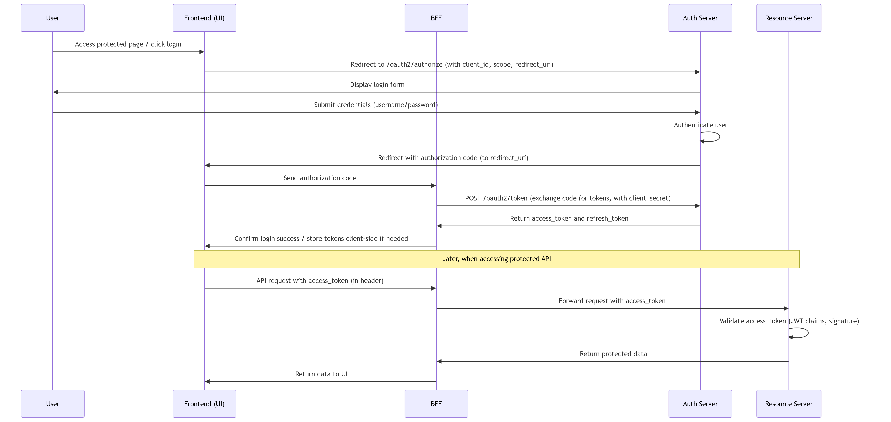

# Banking Application - Team Plan

## Project Overview
A multi-tier banking application with OAuth2 authentication, transaction management, and real-time Kafka events.

**Architecture:**
- **Frontend**: React/Vite SPA with OAuth2 login
- **BFF**: Backend-for-Frontend (Spring Boot, port 8080)
- **Resource Server**: Core banking API (Spring Boot, port 8081)
- **Auth Server**: OAuth2 authorization (mock-auth service)
- **Database**: Oracle 21c XE
- **Message Queue**: Apache Kafka
- **Payment Processor**: WireMock stubs

---

## Phase 1: Foundation & Infrastructure (Week 1-2)

### Infrastructure Team
- [x ] Set up Docker Compose with all services (Oracle, Kafka, WireMock, Zookeeper)
- [x ] Configure Oracle schema and Flyway migrations
- [x ] Test database connectivity and migration execution
- [x ] Verify Kafka cluster initialization and topic creation

**Owner:** DevOps Lead  
**Status:** In Progress  
**Blockers:** Docker Desktop configuration on Windows

### Backend Team - Security & Auth
- [ ] Implement SecurityConfig with OAuth2 JWT validation
- [ ] Set up @WithMockUser and @WithJwt test utilities
- [ ] Implement ResourceNotFoundException and error handling
- [ ] Create mock-auth service for local development

**Owner:** Backend Lead  
**Status:** Blocked - Awaiting infrastructure


### Database Team
- [ ] Design Account, Transaction, User schemas
- [ ] Write Flyway migrations (V1, V2, V3)
- [ ] Create seed data for demo accounts
- [ ] Test rollback and recovery procedures

**Owner:** DBA  
**Status:** In Progress

---

## Phase 2: Core API Development (Week 3-4)

### Backend Team - Resource Server
- [ ] Implement AccountService with loadOwned() ownership check
- [ ] Implement TransactionService for deposits, withdrawals, transfers
- [ ] Create AccountController with GET /api/v1/accounts endpoints
- [ ] Create TransactionController with POST /api/v1/transactions
- [ ] Implement Kafka event publishing for completed transactions

**Owner:** Backend Lead  
**Status:** Not Started

### Testing Team
- [ ] Write integration tests for AccountController
  - [ ] Test unauthenticated requests (401)
  - [ ] Test role-based access (403 for non-admin)
  - [ ] Test ownership enforcement (404 for non-owned accounts)
- [ ] Write integration tests for TransactionController
  - [ ] Test deposit happy path with Kafka event
  - [ ] Test internal transfers (two-row creation)
  - [ ] Test external transfer failures (502 from processor)
- [ ] Achieve >85% code coverage

**Owner:** QA Lead  
**Status:** In Progress (2/5 tests completed)

---

## Phase 3: BFF & Frontend Integration (Week 5-6)

### BFF Team
- [ ] Implement OAuth2 client credentials flow
- [ ] Create WebClient with JWT propagation filter
- [ ] Proxy requests to Resource Server with Bearer token
- [ ] Implement cache layer for user/account data
- [ ] Error mapping and response normalization

**Owner:** Backend Lead (BFF)  
**Status:** Not Started

### Frontend Team
- [ ] React component structure with React Router
- [ ] Implement OAuth2 OIDC login flow
- [ ] Create account dashboard with transaction list
- [ ] Build transaction form (deposit, withdrawal, transfer)
- [ ] Error boundary and loading states

**Owner:** Frontend Lead  
**Status:** Scaffolding complete

---

## Phase 4: Testing & Quality (Week 7-8)

### QA Team
- [ ] End-to-end testing with Playwright/Cypress
- [ ] Performance testing with k6 (concurrent transactions)
- [ ] Security testing (OWASP Top 10)
- [ ] Load testing on Kafka event processing

**Owner:** QA Lead  
**Status:** Not Started

### DevOps Team
- [ ] CI/CD pipeline (GitHub Actions)
- [ ] Automated test execution on PR
- [ ] Docker image builds and registry push
- [ ] Kubernetes manifests for production

**Owner:** DevOps Lead  
**Status:** Not Started

---

## Key Milestones

| Date       | Milestone                                    | Owner           | Status |
|------------|----------------------------------------------|-----------------|--------|
| 2026-05-10 | Infrastructure complete (all containers up) | DevOps Lead     | 🟠     |
| 2026-05-17 | Core API endpoints tested                    | Backend Lead    | 🔴     |
| 2026-05-24 | BFF + Frontend integration complete         | Frontend Lead   | 🔴     |
| 2026-05-31 | E2E tests passing, ready for UAT            | QA Lead         | 🔴     |

**Status Legend:** 🟢 Complete | 🟠 In Progress | 🔴 Not Started | 🔵 Blocked

---

## Team Responsibilities

| Role              | Person     | Contact | Availability |
|-------------------|------------|---------|--------------|
| Backend Lead      | TBD        | TBD     | Full-time    |
| Frontend Lead     | TBD        | TBD     | Full-time    |
| QA Lead           | TBD        | TBD     | Full-time    |
| DevOps Lead       | TBD        | TBD     | Part-time    |
| DBA               | TBD        | TBD     | Part-time    |

---

## Known Issues & Blockers

### Current Issues
1. **Flyway Schema Mismatch** - Oracle BANKAPP schema has existing tables but no history
   - Solution: Clean drop/recreate schema or enable baselineOnMigrate
   - Assigned to: Database Team
   - Priority: 🔴 High

2. **Kafka Listener Configuration** - docker-compose.yml had incorrect advertised listeners
   - Solution: Updated to support internal (kafka:29092) and external (localhost:9092) communication
   - Status: ✅ Fixed

3. **Docker Desktop not running** - Containers failed to start
   - Solution: Start Docker Desktop application
   - Status: ⏳ Awaiting user action

### Upcoming Risks
- Oracle XE 1GB memory limit may cause issues under load (Phase 4)
- Kafka single broker not suitable for production failover testing
- Mock-auth service JWT claims must match Resource Server expectations

---

## Communication & Sync

- **Daily Standup:** 09:30 AM (15 min) - All teams
- **Technical Sync:** Tue/Thu 2:00 PM (30 min) - Leads only
- **Blocker Resolution:** Ad-hoc Slack #banking-app-blockers
- **Status Report:** Friday 4:00 PM - Team Leads to Project Manager

---

## Success Criteria

✅ All core endpoints tested with >85% coverage  
✅ OAuth2 authentication working end-to-end  
✅ Kafka events published and consumed reliably  
✅ Frontend and BFF communicate securely  
✅ All containers running stably in Docker  
✅ Zero critical security vulnerabilities  

---

## Architecture & Flow Diagrams

### Client Request Sequence Diagram



### OAuth2 & API Request Flow

```
PHASE 1: OAUTH2 AUTHENTICATION
═══════════════════════════════════════════════════════════════════════════════

       👤 User          🖥️ Frontend (SPA)      🔵 BFF             🟢 Auth Server
         │                    │                 │                     │
         │─────── (1) ────────>│                 │                     │
         │   Access page/login │                 │                     │
         │                    │                 │                     │
         │                    │─────── (2) ─────────────────────────>│
         │                    │   OAuth2 Authorize (client_id, scope) │
         │                    │                 │                     │
         │<───── (3) ────────────────────────────────────────────────│
         │     Display login form               │                     │
         │                    │                 │                     │
         │─────── (4) ───────────────────────────────────────────────>│
         │    Submit credentials                │                     │
         │                    │                 │                     │
         │                    │                 │    (5) Auth code <──│
         │                    │<────────────────────────────────────│
         │                    │                 │                     │
         │                    │─────── (6) ────>│                     │
         │                    │   Send auth code│                     │
         │                    │                 │                     │
         │                    │                 │─────── (7) ────────>│
         │                    │                 │  Exchange code for  │
         │                    │                 │  tokens + secret    │
         │                    │                 │                     │
         │                    │                 │<───── (8) ─────────│
         │                    │                 │ access_token +      │
         │                    │                 │ refresh_token       │
         │                    │<───── (9) ─────│                     │
         │                    │  Confirm login  │                     │


PHASE 2: ACCESSING PROTECTED API WITH JWT TOKEN
═══════════════════════════════════════════════════════════════════════════════

       👤 User          🖥️ Frontend          🔵 BFF         🔴 Resource Server  💾 Oracle DB
         │                    │                 │                 │                  │
         │─────── (10) ──────>│                 │                 │                  │
         │    View accounts    │                 │                 │                  │
         │                    │                 │                 │                  │
         │                    │─────── (11) ───>│                 │                  │
         │                    │ GET /api/v1/accounts (JWT token)   │                  │
         │                    │                 │                 │                  │
         │                    │                 │─────── (12) ───>│                  │
         │                    │                 │ Forward with Bearer Token           │
         │                    │                 │                 │                  │
         │                    │                 │                 │────── (13) ─────>│
         │                    │                 │                 │  Load owned      │
         │                    │                 │                 │  accounts        │
         │                    │                 │                 │                  │
         │                    │                 │                 │<───── (14) ──────│
         │                    │                 │                 │  Account data    │
         │                    │                 │                 │                  │
         │                    │                 │<───── (15) ─────│                  │
         │                    │                 │ Return account  │                  │
         │                    │                 │ data (200 OK)   │                  │
         │                    │                 │                 │                  │
         │                    │<───── (16) ─────│                 │                  │
         │                    │  Display accounts               │                  │
         │<───── (16) ────────│                 │                 │                  │
         │   Account List     │                 │                 │                  │


PHASE 3: TRANSACTION PROCESSING (DEPOSIT WITH KAFKA)
═══════════════════════════════════════════════════════════════════════════════

       👤 User          🖥️ Frontend          🔵 BFF         🔴 Resource Server  💾 DB  📨 Kafka
         │                    │                 │                 │                 │       │
         │─────── (17) ──────>│                 │                 │                 │       │
         │   Submit deposit    │                 │                 │                 │       │
         │                    │                 │                 │                 │       │
         │                    │─────── (18) ───>│                 │                 │       │
         │                    │ POST /api/v1/transactions (JWT)   │                 │       │
         │                    │ {type: DEPOSIT, amount: 50.00}    │                 │       │
         │                    │                 │                 │                 │       │
         │                    │                 │─────── (19) ───>│                 │       │
         │                    │                 │ Forward txn      │                 │       │
         │                    │                 │                 │                 │       │
         │                    │                 │                 │────── (20) ────>│       │
         │                    │                 │                 │ Create txn row  │       │
         │                    │                 │                 │                 │       │
         │                    │                 │                 │<───── (21) ─────│       │
         │                    │                 │                 │ Txn ID + status │       │
         │                    │                 │                 │                 │       │
         │                    │                 │                 │────────────────────────>│
         │                    │                 │                 │ Publish TransactionEvent│
         │                    │                 │                 │                 │       │
         │                    │                 │                 │<────────────────────────│
         │                    │                 │                 │      Event ACKed│       │
         │                    │                 │                 │                 │       │
         │                    │                 │<───── (24) ─────│                 │       │
         │                    │                 │ Return 201 Created               │       │
         │                    │<───── (25) ─────│                 │                 │       │
         │                    │  Success + confirmation           │                 │       │
         │<───── (25) ────────│                 │                 │                 │       │
         │  Display success   │                 │                 │                 │       │
```

---

**Last Updated:** 2026-05-06  
**Next Review:** 2026-05-13


